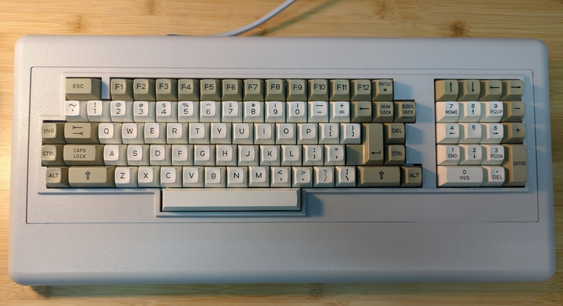
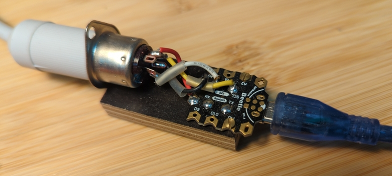

# XtKeyboard

This is about the simplest arduino program for an ATMEGA32U4
processor that I used to connect my old XT keyboard to a
computer using a USB port. I used a 'Beetle' board for the
job.

When I first searched for a similar program, I found some
that were either unnecesarily complicated and/or did not
work reliably. So, in the end, I wrote my own. Although one
could use interrupts, I found no good reason for it --
polling is just good enough, and is simpler.  (Some codes
that I saw and that used interrupts had not been carefully
checked for race conditions; and I would bet there are
related errors in them.)

ATMEGA32U4 is nice (and used) because it has a hardware USB
controller inside.

Arduino (language) is used because there is the Keyboard
library available, which takes care (and hides complexity)
of the USB-related stuff. Had it not been for this, a
standalone C program would have been better.

The code was written with the sole aim to connect one
particular keyboard, Zbrojovka Brno Consul 262.9, and hence
may or may not work with others. The picture of the keyboard
as well as of the 'connection' board is included. The
keyboard is connected using a 5-PIN DIN 41524 connector.
Four wires are used: VCC, GND, CLOCK, DATA. As written in
the program, DATA goes to the D3/SCL pin (PD0 of the
processor) and CLOCK goes to the D2/SDA pin (PD1 of the
processor).

The CLOCK is generated by the keyboard, falling edges are
important.  E.g., pressing the Space key on the keyboard
generates 10 bits: 0 1 1 0 0 1 1 1 0 0 on the DATA wire. The
first two bits are always the same, the other eight carry
the information about the key. Since the least significant
bit is sent first, the code sent is to be read backwards,
i.e., 0 0 1 1 1 0 0 1 = 39h = 57. Release code differs from
the press code by 128, i.e., for the Space key is 57 + 128 =
185.

(The programming of the beetle was done using Arduino IDE
and the usbasp programmer, but any other method is, of
course, possible.)

